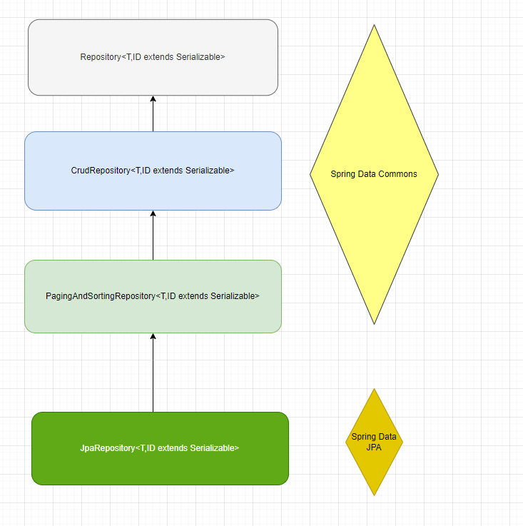
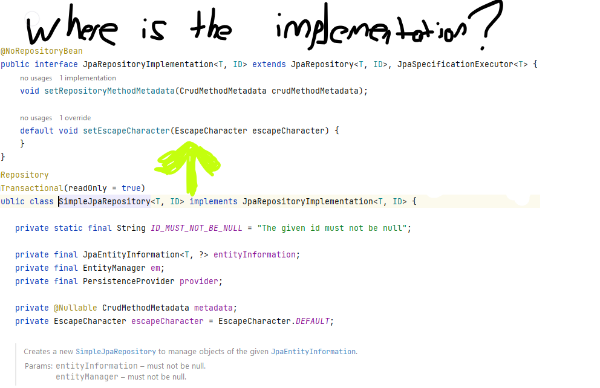
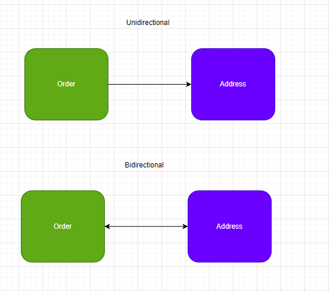

# MASTERING SPRING DATA

* **JPA**: facilitate orm to manage relational data in java application. ıt provıdes platform to work directly with an object instead of using SQL statements.\
  **_Jpa Implementation_**: _hibernate, eclipselink, toplınk, mybatis._
* Spring Data Jpa uses EntityManager and TypedQuery

Repository <---------->    EntityManager

flush()     ------>     flush()

save(S)     ------>     persist(), merge()

delete(T)   ------>     remove(), merge(), contains()

findOne(ID) ------>     find()

* Spring Data JPA ---> JPA ---> HIBERNATE(JDBC) ----> DB

## Generation Type
**GenerationType.AUTO** = our default persistence provider which using hibernate, it selects based on database specific dialect. \
**GenerationType.IDENTITY**= +1

### JPA METHODS
#### save
> **S save(S entity)** \
Saving entity can be performed using save from CrudRepository.\
It persist or merge.\
If entity has not been persisted Spring Data JPA call entityManager.persist() otherwise call entityManager.merge().

### Define JPQL query using @Query annotation with index or position parameters
    @Query("SELECT p from Product p where p.name = ?1 or p.description = ?2")
    Product findByNameOrDescriptionJPQLIndexParam(String name, String description);

### Define JPQL query using @Query annotation with Named parameters
    @Query("SELECT p from Product p where p.name = :name or p.description = :description")
    Product findByNameOrDescriptionJPQLNamedParam(@Param("name") String name,@Param("description") String description);

### Define a Native SQL query using @Query annotation with index or position parameters
    @Query(value = "select * from products p where p.name = ?1 or p.description = ?2", nativeQuery = true)
    Product findByNameOrDescriptionSQLIndexParam(String name, String description);

### Define a Native SQL query using @Query annotation with Named parameters
    @Query(value = "select * from products p where p.name = :name or p.description = :description", nativeQuery = true)
    Product findByNameOrDescriptionSQLNamedParam(@Param("name") String name, @Param("description") String description);

## PAGINATION AND SORTING

    Pageable pageable = PageRequest.of(0,5);
    Page<Product> page = repository.findAll(pageable);
    List<Product> products = page.getContent();

Sorting

    Sort sort = Sort.by("name").ascending();
    List<Product> sortedProducts = repository.findAll(sort);

with multiple fields

    Sort sortName = Sort.by("Name").descending();
    Sort sortDescription = Sort.by("Description").ascending();
    Sort multipleSort = sortName.and(sortDescription) 

sort and pageable

    Pageable pageable1 = PageRequest.of(0,5,sort);

**Default Lazy Type**

FetchType.Eager = **Eager** means it will retrieve everything.\
FetchType.Lazy = **Lazy** means it will retrieve on request or on demand.

OneToMany: Lazy \
ManyToMany: Eager \
ManyToMany: Lazy \
OneToOne: Eager

